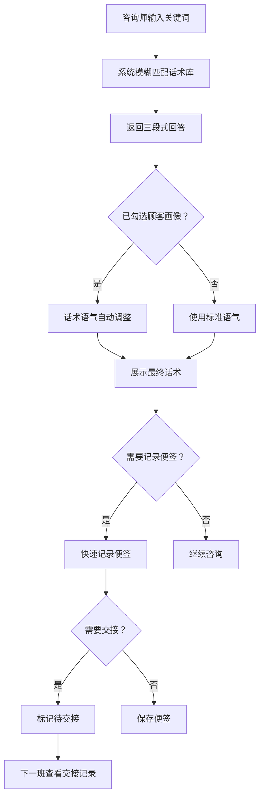

## 1. 产品概述

面诊话术速查工具——专为医美门店咨询师与前台临时顶岗人员打造的极简桌面端话术检索与辅助工具，解决高峰期记不住标准表达、遗漏禁忌追问、交接信息丢失三大痛点。

## 2. 核心功能

### 2.1 用户角色

| 角色 | 使用方式 | 核心权限 |
|------|----------|----------|
| 咨询师/前台 | 直接使用 | 搜索话术、查看词库、勾选画像、记录便签、查看交接 |
| 主管 | 密码进入管理面板 | 维护门店专属表达、禁用夸大承诺、活动套餐说明、投诉回应模板 |

### 2.2 功能模块

1. **快捷搜索窗口**：关键词输入，即时返回三段式回答（共情→解释→引导医生评估）
2. **项目词库窗口**：按品类浏览项目（抗衰、注射、光电、美肤等），查看标准化话术与常见问答
3. **顾客画像窗口**：勾选标签（新客/熟客/敏感肌/婚前急需/术后返修等），话术语气自动调整
4. **禁忌提醒窗口**：列出必须追问事项（孕期/瘢痕体质/近期服药/皮肤破损等），避免只顾成交
5. **话术便签窗口**：快速记录顾客原话、关注项目、可接受价位、反感点，支持交接给医生或下一班
6. **交接记录窗口**：查看历史便签与交接记录，确保信息连续

### 2.3 页面详情

| 页面名称 | 模块名称 | 功能描述 |
|----------|----------|----------|
| 主界面 | 快捷搜索栏 | 顶部常驻搜索输入框，支持模糊匹配关键词，输入即搜 |
| 主界面 | 六窗口标签切换 | 左侧/顶部标签页切换六个功能窗口 |
| 快捷搜索窗口 | 搜索结果区 | 显示匹配话术，每条以三段式结构展示：共情（暖色标识）→解释（中性色标识）→引导评估（强调色标识） |
| 快捷搜索窗口 | 画像联动指示 | 显示当前顾客画像标签，话术自动适配语气 |
| 项目词库窗口 | 品类分类导航 | 按抗衰/注射/光电/美肤/身体等品类分栏 |
| 项目词库窗口 | 项目详情卡片 | 展示项目简介、标准话术、常见问答、注意事项 |
| 顾客画像窗口 | 标签勾选面板 | 新客/熟客/敏感肌/婚前急需/术后返修/高消费力/价格敏感/犹豫型等标签 |
| 顾客画像窗口 | 语气预览 | 实时预览当前标签组合下的典型话术语气 |
| 禁忌提醒窗口 | 必追问清单 | 孕期/哺乳期/瘢痕体质/近期服药/皮肤破损/过敏史/免疫系统疾病等 |
| 禁忌提醒窗口 | 红旗警示 | 命中禁忌项时醒目高亮提醒 |
| 话术便签窗口 | 快速记录表单 | 顾客原话/关注项目/可接受价位/反感点四个快捷输入区 |
| 话术便签窗口 | 便签列表 | 已记录便签卡片列表，支持标记交接状态 |
| 交接记录窗口 | 交接时间线 | 按时间排列的交接记录 |
| 交接记录窗口 | 交接详情 | 展示完整便签内容、交接人、接收人 |
| 管理面板 | 门店专属表达管理 | 增删改门店定制话术 |
| 管理面板 | 禁用夸大承诺设置 | 维护禁止使用的表达清单 |
| 管理面板 | 活动套餐说明 | 编辑当前活动与套餐的标准说明话术 |
| 管理面板 | 投诉回应模板 | 维护常见投诉的标准回应话术 |

## 3. 核心流程

### 3.1 咨询师搜索话术流程
1. 咨询师在快捷搜索栏输入关键词（如"热玛吉疼不疼"）
2. 系统模糊匹配话术库，返回相关结果
3. 每条结果以三段式展示：共情→解释→引导医生评估
4. 若已勾选顾客画像标签，话术语气自动调整
5. 咨询师可一键复制话术或加入便签

### 3.2 便签交接流程
1. 咨询师在便签窗口快速记录关键信息
2. 标记为"待交接"
3. 下一班咨询师或医生在交接记录窗口查看
4. 接收后标记为"已交接"

### 3.3 主管维护流程
1. 主管通过密码进入管理面板
2. 维护门店专属表达、禁用承诺、活动套餐、投诉模板
3. 修改即时生效，影响所有咨询师的搜索结果

## 4. 用户界面设计

### 4.1 设计风格
- **主色调**：温暖的米白/奶油色为底（#FAF7F2），搭配深棕文字（#2D2016），传递专业与信赖感
- **强调色**：珊瑚橙（#E8734A）用于关键操作与警示，薄荷绿（#4CAF82）用于确认与安全状态
- **按钮风格**：圆角胶囊按钮，带轻微阴影，hover 时微上浮
- **字体**：标题使用 Noto Serif SC（宋体衬线），正文使用 Noto Sans SC（无衬线），营造专业医美感
- **布局风格**：左侧固定标签导航 + 右侧内容区，桌面优先
- **图标风格**：线条简洁的线性图标（lucide-react）

### 4.2 页面设计概述

| 页面名称 | 模块名称 | UI元素 |
|----------|----------|--------|
| 主界面 | 顶部搜索栏 | 固定顶部，搜索图标+输入框，圆角背景，输入时展开下拉结果 |
| 主界面 | 左侧标签导航 | 垂直排列6个标签，图标+文字，当前项珊瑚橙高亮 |
| 快捷搜索窗口 | 三段式结果卡片 | 三段依次排列，各段左侧竖线颜色区分（暖橙/灰蓝/翠绿），一键复制按钮 |
| 项目词库窗口 | 品类标签栏 | 横向可滚动品类标签，选中项底部加粗下划线 |
| 项目词库窗口 | 项目卡片网格 | 双列卡片，含项目名/简介/标签/展开详情 |
| 顾客画像窗口 | 标签云面板 | 圆角标签按钮，勾选后填充色+勾号，分组排列 |
| 禁忌提醒窗口 | 检查清单 | 勾选式清单，未勾选项文字加粗红点标记，命中项背景泛红 |
| 话术便签窗口 | 便签编辑器 | 四个文本域+快速标签按钮，便签卡片带时间戳 |
| 交接记录窗口 | 时间线列表 | 左侧时间轴线，右侧内容卡片，状态标签（待交接/已交接） |
| 管理面板 | 管理标签页 | 横向四个管理标签，内容区为表格+编辑弹窗 |

### 4.3 响应式设计
- 桌面优先设计，最小宽度 1024px
- 在 1024-1280px 之间保持左侧导航折叠为图标模式
- 1280px 以上完整展示

### 4.4 动效设计
- 标签切换：淡入淡出过渡（200ms）
- 搜索结果：列表项依次滑入（stagger 50ms）
- 标签勾选：弹跳缩放效果
- 禁忌命中：脉冲红色边框闪烁
- 便签保存：飞入动画
