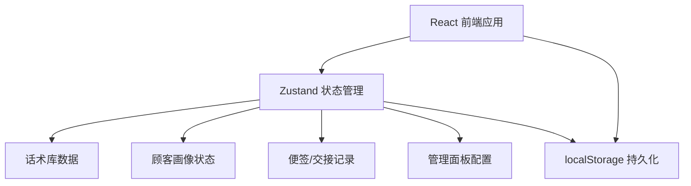
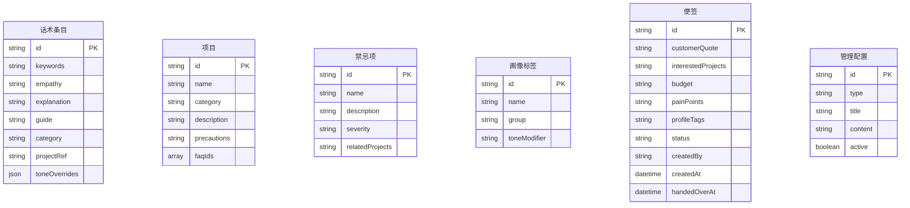

## 1. 架构设计

本项目为纯前端桌面端应用，所有数据存储于浏览器 localStorage，无需后端服务。



## 2. 技术说明

- **前端**：React@18 + TypeScript + Tailwind CSS@3 + Vite
- **初始化工具**：vite-init（react-ts 模板）
- **后端**：无（纯前端应用，数据存储于 localStorage）
- **数据库**：无（localStorage 替代，主管管理数据同样本地存储）
- **状态管理**：Zustand（含 persist 中间件自动持久化到 localStorage）
- **图标库**：lucide-react

## 3. 路由定义

| 路由 | 用途 |
|------|------|
| / | 主界面，含搜索栏与六窗口标签切换 |
| /admin | 主管管理面板（需密码验证） |

## 4. 数据模型

### 4.1 数据模型定义



### 4.2 核心数据结构

#### 话术条目（ScriptEntry）
```typescript
interface ScriptEntry {
  id: string
  keywords: string[]
  empathy: string
  explanation: string
  guide: string
  category: string
  projectRef?: string
  toneOverrides?: Record<string, { empathy?: string; explanation?: string; guide?: string }>
}
```

#### 项目（Project）
```typescript
interface Project {
  id: string
  name: string
  category: 'anti-aging' | 'injection' | 'laser' | 'skincare' | 'body'
  description: string
  precautions: string[]
  standardScript: string
  faqs: Array<{ q: string; a: string }>
}
```

#### 禁忌项（Contraindication）
```typescript
interface Contraindication {
  id: string
  name: string
  description: string
  severity: 'critical' | 'warning'
  relatedProjects: string[]
  mustAsk: string
}
```

#### 画像标签（ProfileTag）
```typescript
interface ProfileTag {
  id: string
  name: string
  group: 'frequency' | 'skin' | 'urgency' | 'spending' | 'personality'
  toneModifier: 'warm' | 'professional' | 'urgent' | 'cautious' | 'enthusiastic'
  description: string
}
```

#### 便签（Note）
```typescript
interface Note {
  id: string
  customerQuote: string
  interestedProjects: string[]
  budget: string
  painPoints: string
  profileTagIds: string[]
  status: 'draft' | 'pending-handover' | 'handed-over'
  createdBy: string
  createdAt: string
  handedOverAt?: string
}
```

#### 管理配置（AdminConfig）
```typescript
interface AdminConfig {
  id: string
  type: 'store-expression' | 'banned-claim' | 'promotion' | 'complaint-template'
  title: string
  content: string
  active: boolean
}
```

## 5. 核心模块划分

| 模块 | 职责 |
|------|------|
| src/store/scriptStore | 话术库状态管理（搜索、筛选、画像联动） |
| src/store/profileStore | 顾客画像标签状态管理 |
| src/store/noteStore | 便签与交接记录状态管理 |
| src/store/adminStore | 管理面板配置状态管理 |
| src/data/scripts | 初始话术库数据 |
| src/data/projects | 初始项目词库数据 |
| src/data/contraindications | 初始禁忌清单数据 |
| src/data/profileTags | 初始画像标签数据 |
| src/components/SearchPanel | 快捷搜索窗口组件 |
| src/components/ProjectGlossary | 项目词库窗口组件 |
| src/components/CustomerProfile | 顾客画像窗口组件 |
| src/components/Contraindications | 禁忌提醒窗口组件 |
| src/components/ScriptNotes | 话术便签窗口组件 |
| src/components/HandoverRecords | 交接记录窗口组件 |
| src/components/AdminPanel | 管理面板组件 |
| src/utils/searchEngine | 模糊搜索引擎（关键词匹配+权重排序） |
| src/utils/toneAdapter | 话术语气适配器（根据画像标签调整语气） |
